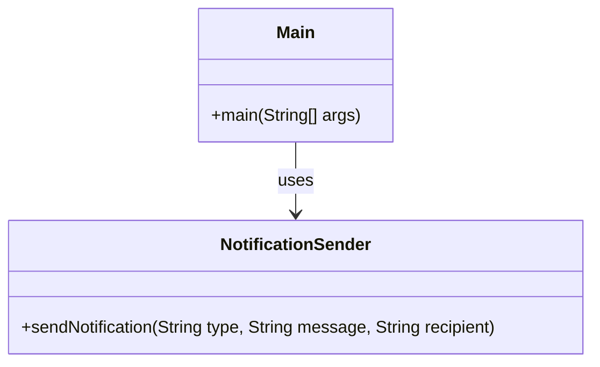

# UML Sınıf Diyagramı - Faz 0 (Başlangıç - Kötü Tasarım)

## Açıklama
Başlangıç tasarımında tek bir sınıf (`NotificationSender`) tüm bildirim tiplerinin (Email, SMS, Push) gönderim mantığını if-else zincirleriyle içinde barındırıyor. Bu sınıf bir **God Class** anti-pattern'idir.
