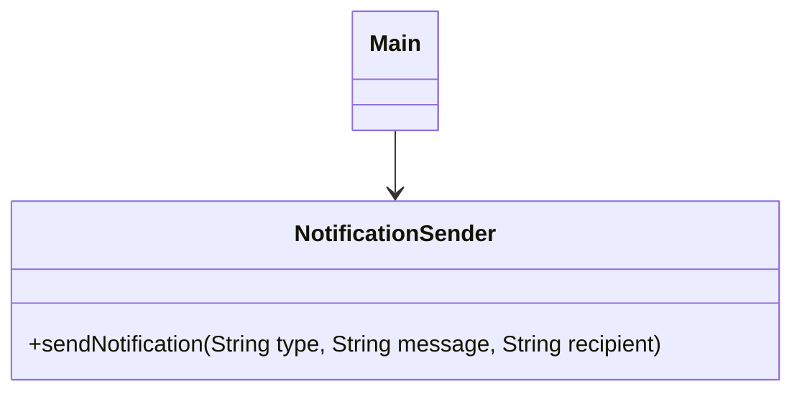
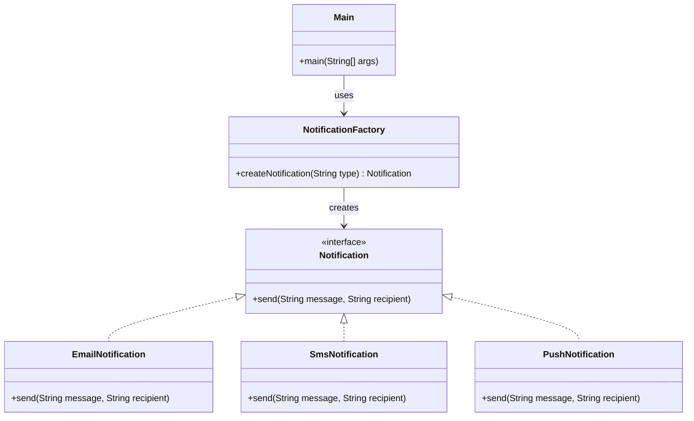

# UML Sınıf Diyagramı - Faz 1 (Factory Method Uygulaması)

## Öncesi

## Sonrası

## Açıklama
God Class olan `NotificationSender` kaldırıldı. Yerine `Notification` arayüzü ve her bildirim tipi için ayrı sınıflar oluşturuldu. `NotificationFactory` nesne yaratımını merkezi hale getirdi.
