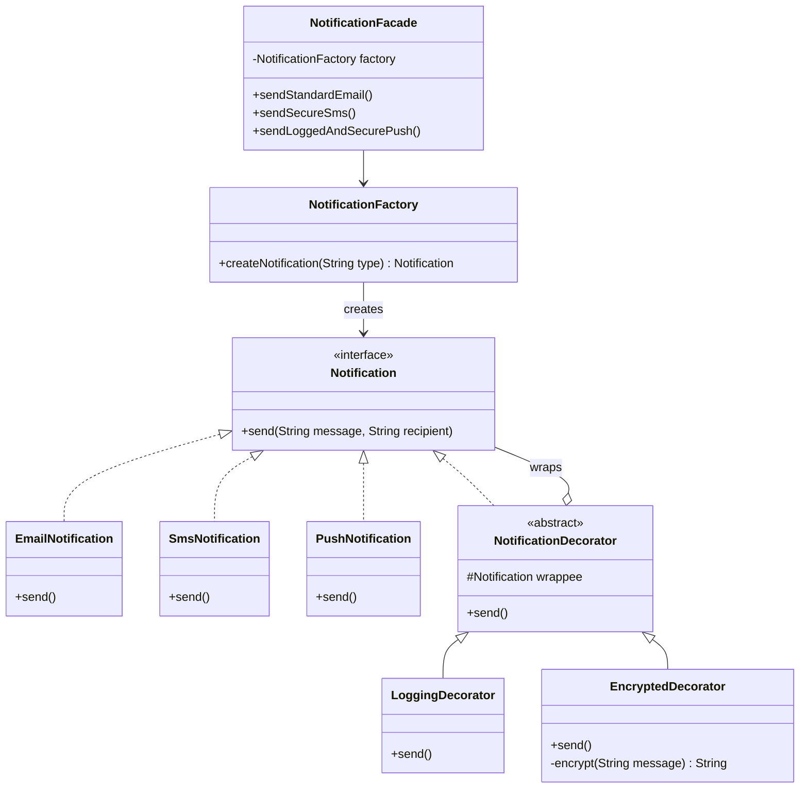

# UML Sınıf Diyagramı - Faz 2 (Decorator & Facade Uygulaması)

## Açıklama
Decorator örüntüsü ile mevcut bildirim sınıflarını değiştirmeden loglama ve şifreleme özellikleri eklendi. Facade örüntüsü ile karmaşık alt sistem basit metotların arkasına gizlendi.
