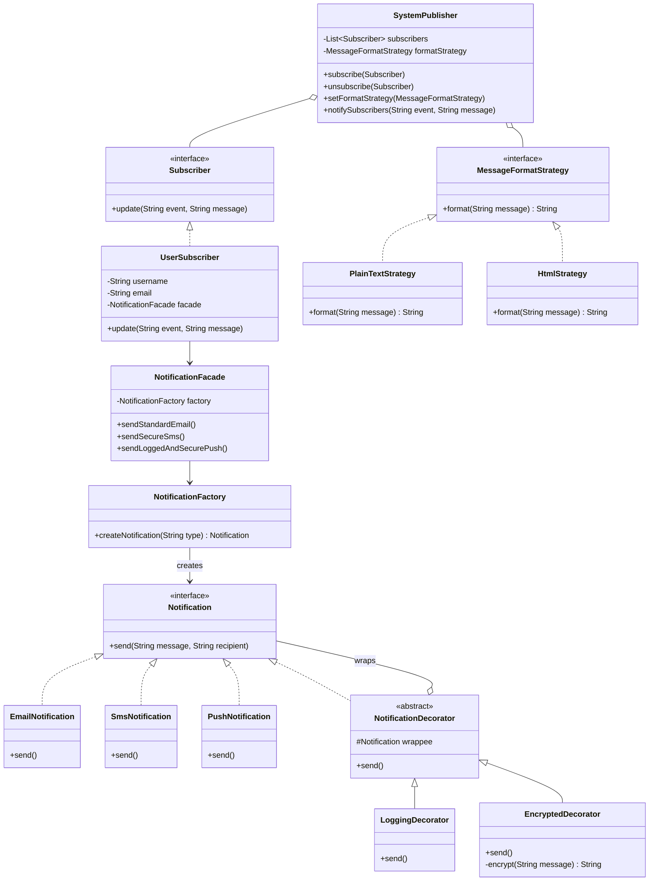

# UML Sınıf Diyagramı - Faz 3 (Strategy & Observer Uygulaması - Final Mimari)

## Açıklama
Strategy örüntüsü ile mesaj formatlama algoritması çalışma zamanında değiştirilebilir hale geldi. Observer örüntüsü ile olay tabanlı bildirim dağıtımı kuruldu. Yeni davranış eklemek için mevcut kodu değiştirmeye gerek kalmadı (OCP).
